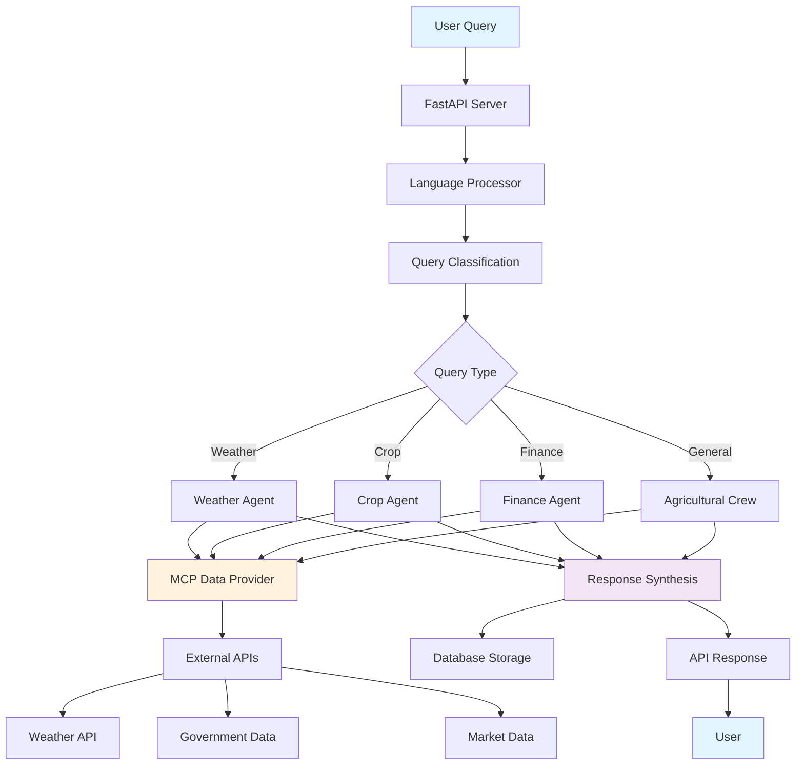
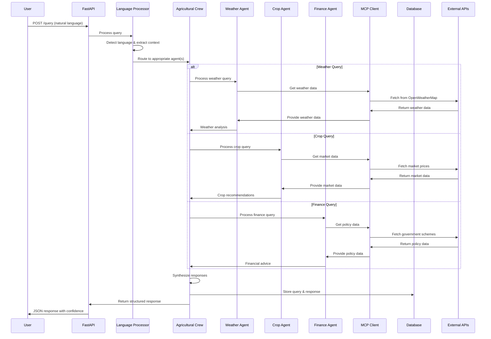
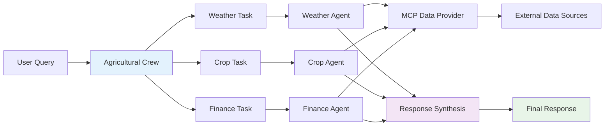

# 🌾 KrishiSetu - System Architecture Documentation

## 📋 Table of Contents
1. [System Overview](#system-overview)
2. [Architecture Layers](#architecture-layers)
3. [Component Details](#component-details)
4. [Data Flow](#data-flow)
5. [Technology Stack](#technology-stack)
6. [Deployment Architecture](#deployment-architecture)

## 🎯 System Overview

KrishiSetu is a multi-agent AI system designed to provide comprehensive agricultural advisory services. The system uses a layered architecture with specialized AI agents, real-time data integration, and multilingual support.

## 🏗️ Architecture Layers

### Layer 1: API Layer (Presentation)
```
┌─────────────────────────────────────────────────────────────┐
│                    API Layer (FastAPI)                      │
├─────────────────────────────────────────────────────────────┤
│  ┌─────────────┐  ┌─────────────┐  ┌─────────────┐         │
│  │   REST API  │  │  Request    │  │  Response   │         │
│  │  Endpoints  │  │ Validation  │  │  Models     │         │
│  └─────────────┘  └─────────────┘  └─────────────┘         │
│  ┌─────────────┐  ┌─────────────┐  ┌─────────────┐         │
│  │   CORS      │  │  Error      │  │  Health     │         │
│  │ Middleware  │  │ Handling    │  │  Checks     │         │
│  └─────────────┘  └─────────────┘  └─────────────┘         │
└─────────────────────────────────────────────────────────────┘
```

### Layer 2: Core AI Layer (Business Logic)
```
┌─────────────────────────────────────────────────────────────┐
│                   Core AI Layer (CrewAI)                    │
├─────────────────────────────────────────────────────────────┤
│  ┌─────────────┐  ┌─────────────┐  ┌─────────────┐         │
│  │Agricultural │  │  Weather    │  │   Crop      │         │
│  │   Crew      │  │   Agent     │  │   Agent     │         │
│  └─────────────┘  └─────────────┘  └─────────────┘         │
│  ┌─────────────┐  ┌─────────────┐  ┌─────────────┐         │
│  │  Finance    │  │  Language   │  │   Base      │         │
│  │   Agent     │  │ Processor   │  │   Agent     │         │
│  └─────────────┘  └─────────────┘  └─────────────┘         │
└─────────────────────────────────────────────────────────────┘
```

### Layer 3: Data Layer (Persistence & External)
```
┌─────────────────────────────────────────────────────────────┐
│                    Data Layer                               │
├─────────────────────────────────────────────────────────────┤
│  ┌─────────────┐  ┌─────────────┐  ┌─────────────┐         │
│  │   MCP       │  │  Database   │  │  External   │         │
│  │  Client     │  │  Models     │  │   APIs      │         │
│  └─────────────┘  └─────────────┘  └─────────────┘         │
│  ┌─────────────┐  ┌─────────────┐  ┌─────────────┐         │
│  │  SQLite     │  │  SQLAlchemy │  │  Config     │         │
│  │  Database   │  │    ORM      │  │ Management  │         │
│  └─────────────┘  └─────────────┘  └─────────────┘         │
└─────────────────────────────────────────────────────────────┘
```

## 🔄 Data Flow Architecture



## 🧩 Component Details

### 1. API Layer Components

#### FastAPI Server (`api/main.py`)
- **Purpose**: Main web server handling HTTP requests
- **Features**:
  - Async request processing
  - CORS middleware for cross-origin requests
  - Automatic API documentation (Swagger/OpenAPI)
  - Request/response validation with Pydantic

#### API Endpoints
```python
# Main query processing
POST /query - Process agricultural queries
POST /query/weather - Weather-specific queries
POST /query/crop - Crop-specific queries
POST /query/finance - Finance-specific queries

# System information
GET /agents - List available AI agents
GET /examples - Get example queries
GET /supported-languages - List supported languages
GET / - Health check endpoint
```

### 2. Core AI Layer Components

#### Agricultural Crew (`crew/agricultural_crew.py`)
- **Purpose**: Orchestrates multiple AI agents using CrewAI
- **Responsibilities**:
  - Task distribution among agents
  - Response synthesis and coordination
  - Confidence scoring
  - MCP data integration

#### Base Agent (`agents/base_agent.py`)
- **Purpose**: Abstract base class for all AI agents
- **Features**:
  - Common agent functionality
  - LLM integration (OpenAI GPT-4)
  - Tool management
  - Confidence scoring

#### Specialized Agents

##### Weather Agent (`agents/weather_agent.py`)
```python
class WeatherAgent(BaseAgent):
    - get_current_weather(location)
    - get_weather_forecast(location)
    - analyze_irrigation_needs(weather_data)
    - get_soil_moisture_analysis(location)
```

##### Crop Agent (`agents/crop_agent.py`)
```python
class CropAgent(BaseAgent):
    - get_crop_recommendations(location, soil, season)
    - analyze_crop_suitability(crops, context)
    - get_market_prices(crops)
    - get_crop_calendar(season)
    - analyze_pest_risks(crop, location)
```

##### Finance Agent (`agents/finance_agent.py`)
```python
class FinanceAgent(BaseAgent):
    - get_loan_options(farmer_type, land_area, crop)
    - get_government_schemes(state, farmer_type)
    - analyze_market_trends(crop_type)
    - get_insurance_options(crop, land_area)
    - calculate_loan_eligibility(farmer_type, land_area, context)
```

#### Language Processor (`utils/language_processor.py`)
- **Purpose**: Handles multilingual query processing
- **Features**:
  - Language detection (10 Indian languages)
  - Query classification
  - Context extraction
  - Translation support

### 3. Data Layer Components

#### MCP Client (`mcp/mcp_client.py`)
- **Purpose**: Model Context Protocol integration
- **Features**:
  - External data source integration
  - Weather data retrieval
  - Market data access
  - Government data fetching

#### Database Models (`models/database.py`)
```python
# Core entities
User - User profiles and preferences
Query - Query history and responses
WeatherData - Weather information storage
CropData - Crop information and recommendations
PolicyData - Government schemes and policies
```

#### Configuration (`config.py`)
- **Purpose**: Centralized configuration management
- **Features**:
  - API key management
  - Database configuration
  - Supported languages
  - Agricultural data constants

## 🔄 Detailed Data Flow

### 1. Query Processing Flow


### 2. Multi-Agent Collaboration


## 🛠️ Technology Stack

### Backend Framework
- **FastAPI**: High-performance web framework
- **Uvicorn**: ASGI server
- **Pydantic**: Data validation and serialization

### AI & Machine Learning
- **CrewAI**: Multi-agent orchestration
- **LangChain**: LLM integration and tool management
- **OpenAI GPT-4**: Large language model
- **Tavily**: Web search capabilities

### Database & ORM
- **SQLAlchemy**: Object-relational mapping
- **SQLite**: Lightweight database
- **Alembic**: Database migrations

### External Integrations
- **MCP (Model Context Protocol)**: External data integration
- **OpenWeatherMap API**: Weather data
- **Government Data APIs**: Agricultural policies
- **Market Data APIs**: Price information

### Utilities & Tools
- **Python-dotenv**: Environment variable management
- **Requests**: HTTP client library
- **Aiohttp**: Async HTTP client
- **BeautifulSoup4**: Web scraping

## 🚀 Deployment Architecture

### Development Environment
```
┌─────────────────────────────────────────────────────────────┐
│                    Development Setup                        │
├─────────────────────────────────────────────────────────────┤
│  ┌─────────────┐  ┌─────────────┐  ┌─────────────┐         │
│  │   Python    │  │  Virtual    │  │  IDE/Editor │         │
│  │  3.8+       │  │ Environment │  │             │         │
│  └─────────────┘  └─────────────┘  └─────────────┘         │
│  ┌─────────────┐  ┌─────────────┐  ┌─────────────┐         │
│  │  API Keys   │  │  Local      │  │  Testing    │         │
│  │  (.env)     │  │  Database   │  │  Framework  │         │
│  └─────────────┘  └─────────────┘  └─────────────┘         │
└─────────────────────────────────────────────────────────────┘
```

### Production Deployment
```
┌─────────────────────────────────────────────────────────────┐
│                   Production Architecture                   │
├─────────────────────────────────────────────────────────────┤
│  ┌─────────────┐  ┌─────────────┐  ┌─────────────┐         │
│  │   Load      │  │  FastAPI    │  │  Database   │         │
│  │ Balancer    │  │  Servers    │  │  Cluster    │         │
│  └─────────────┘  └─────────────┘  └─────────────┘         │
│  ┌─────────────┐  ┌─────────────┐  ┌─────────────┐         │
│  │  CDN/       │  │  Monitoring │  │  Backup &   │         │
│  │  Cache      │  │  & Logging  │  │  Recovery   │         │
│  └─────────────┘  └─────────────┘  └─────────────┘         │
└─────────────────────────────────────────────────────────────┘
```

## 📊 System Metrics & Monitoring

### Performance Metrics
- **Response Time**: < 2 seconds for simple queries
- **Throughput**: 100+ concurrent requests
- **Availability**: 99.9% uptime
- **Accuracy**: > 85% confidence score

### Monitoring Points
- API endpoint response times
- Agent processing times
- External API call success rates
- Database query performance
- Memory and CPU usage

## 🔒 Security Considerations

### API Security
- Input validation and sanitization
- Rate limiting
- CORS configuration
- API key management

### Data Security
- Database encryption
- Secure API key storage
- Audit logging
- Data privacy compliance

## 🚀 Future Enhancements

### Planned Features
1. **Voice Interface**: Speech-to-text and text-to-speech
2. **Mobile App**: Native mobile application
3. **Offline Mode**: Local processing capabilities
4. **Advanced Analytics**: Predictive modeling
5. **IoT Integration**: Sensor data integration
6. **Blockchain**: Transparent supply chain tracking

### Scalability Improvements
1. **Microservices**: Service decomposition
2. **Containerization**: Docker deployment
3. **Cloud Native**: Kubernetes orchestration
4. **Caching**: Redis integration
5. **Message Queues**: Async processing

---

*This architecture documentation provides a comprehensive overview of the KrishiSetu Agricultural AI Advisor system, detailing its components, data flow, and technical implementation.* 